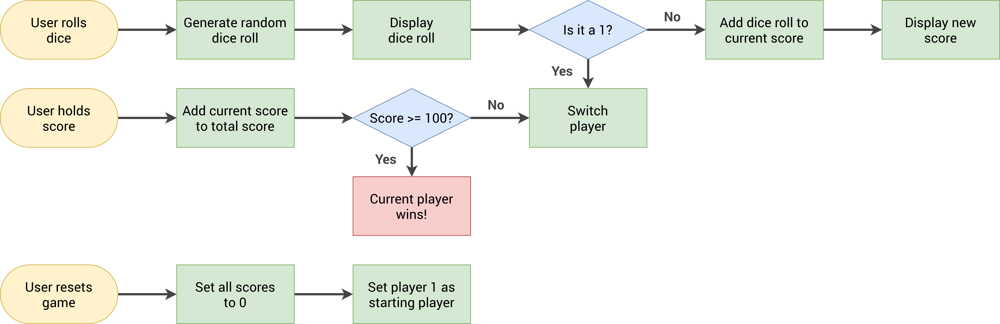

# PigGame
Pig-game(ludo) is a classic board game played between friends and family. Play the dice game of kings! Recall your childhood!

## Live Demo 🌐

**You Can See The `Tracker` Live On:** [Here](https://6320c882dc53d10c7c1baa07--shimmering-salamander-32502b.netlify.app/)

## GAME RULES:

- The game has 2 players, playing in rounds
- In each turn, a player rolls a dice as many times as he wishes. Each result get added to his ROUND score
- BUT, if the player rolls a 1, all his ROUND score gets lost. After that, it's the next player's turn
- The player can choose to 'Hold', which means that his ROUND score gets added to his GLOBAL score. After that, it's the next player's turn
- The first player to reach 100 points on GLOBAL score wins the game.

## How to win:
The player with the greater value on the side of the dice wins.

# Setting up the project
Step 1 : Fork, Clone and Remote  
Step 2 : Open project code in Visual Studio Code, Sublime Text or your favorite editor 
Now you are ready to get started 🎉 

# Contact

If you wanna get in touch with me:  

-   Gmail: **[`abdallahelal102@gmail.com`]**
-   **[LinkedIN](https://www.linkedin.com/in/abdalla-emad-40732b1b6/)**
